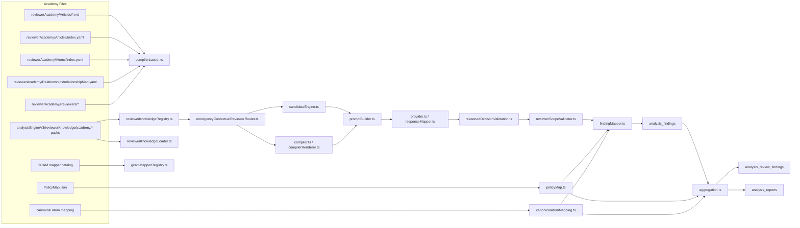

# ACADEMY_DEPENDENCY_GRAPH

## Executive Summary

The Reviewer Academy is not a single subsystem. It is a set of overlapping loaders, registries, rankers, validators, mappers, and report materializers.

The current architecture depends on stable:

- reviewer names and reviewer ids
- article ids
- atom ids
- PolicyMap.json
- canonical article titles
- canonical atom names

The safest mental model is:

- reviewer names are used for routing, scope, packaging, and display
- article ids are the primary join key across router, validator, mapper, persistence, and reports
- atom ids are the secondary join key inside an article
- PolicyMap is the main source of official Arabic article/atom titles
- canonical atom names are the semantic bridge between GCAM mappings and reporting

This means renaming anything without updating every dependent registry can break classification, persistence, or reporting.

## Architecture Diagram

## Dependency Graph

### 1) Reviewer Names

Reviewer names appear in routing, scope declarations, academy relationships, compiled packages, and labels shown in the report.

| File | Function | Read/Write | Can renaming break it? | Can moving academy files break it? | Can changing folder names break it? | Risk |
|---|---|---:|---:|---:|---:|---:|
| `apps/worker/src/analysisEngineV3/reviewerKnowledge/emergencyContextualReviewerRouter.ts` | `createEmergencyContextualReviewerRoutingReport`, `scoreProfile`, `buildRoutingReason` | Read | Yes | Indirectly | Yes | High |
| `apps/worker/src/analysisEngineV3/reviewerKnowledge/reviewerScopeMatrix.ts` | `getReviewerScopeDeclaration`, `getReviewerScopeDeclarationsByIds` | Read | Yes | No | No | High |
| `apps/worker/src/analysisEngineV3/reviewerKnowledge/reviewerKnowledgeRegistry.ts` | `buildCanonicalArticleOwnershipMap`, `resolveCanonicalOwnerFromPackMappings` | Read | Yes | No | Yes | High |
| `apps/worker/src/analysisEngineV3/reviewerCompiler/compilerLoader.ts` | `buildArticlesByReviewer`, `validateRegistry`, `classifyManualFolder` | Read | Yes | Yes | Yes | High |
| `apps/worker/src/analysisEngineV3/reviewerCompiler/compiler.ts` | `buildCompiledContext`, `buildCompiledPackages`, `resolveAcademyFolder` | Read | Yes | Yes | Yes | High |
| `apps/worker/src/analysisEngineV3/runtime/reviewerScopeValidator.ts` | `validateReviewerScope` | Read/Write | Yes | No | No | High |
| `apps/worker/src/analysisEngineV3/provider/reasonedDecisionValidation.ts` | `validateReasonedDecisionAgainstEvidence` | Read | Yes | No | No | Medium |
| `apps/worker/src/analysisEngineV3/ranking/candidateEngine.ts` | `createDeterministicCandidateCompiledContext` | Read | Yes | Yes | Yes | High |
| `apps/worker/src/analysisEngineV3/reviewerKnowledge/academy/reviewerAcademyLoader.ts` | `discoverAcademyPackDocuments` | Read | Yes | Yes | Yes | High |
| `apps/worker/src/aggregation.ts` | `buildReviewFindingRows`, `buildReportHtml`, `applyReportGate` | Read | Yes | No | No | Medium |

**What can be lost or rewritten**

- reviewer labels can be changed during routing output formatting
- reviewer ids can be reassigned in scope validation if canonical ownership differs
- reviewer names can be normalized by folder matching and aliasing

**Can classification change?**

Yes. Reviewer selection is not just display-only. It affects which knowledge packs load, which article candidates are available, and which findings survive validation.

### 2) Article Ids

Article ids are the main structural join key for the entire pipeline.

| File | Function | Read/Write | Can renaming break it? | Can moving academy files break it? | Can changing folder names break it? | Risk |
|---|---|---:|---:|---:|---:|---:|
| `apps/worker/src/policyMap.ts` | `getPolicyArticle`, `getPolicyArticles`, `getPolicyAtomIdsForArticle`, `getPolicyAtomTitle`, `isValidAtomForArticle` | Read | Yes | No | No | High |
| `apps/worker/src/canonicalAtomMapping.ts` | `getGcamRefsForCanonicalAtom`, `getPrimaryGcamForCanonicalAtom`, `getCanonicalAtomsForGcam` | Read | Yes | No | No | High |
| `apps/worker/src/analysisEngineV3/reviewerKnowledge/reviewerKnowledgeRegistry.ts` | `buildCanonicalArticleOwnershipMap` | Read | Yes | No | Yes | High |
| `apps/worker/src/analysisEngineV3/reviewerKnowledge/emergencyContextualReviewerRouter.ts` | `createEmergencyContextualReviewerKnowledgeSelection` | Read | Yes | No | Yes | High |
| `apps/worker/src/analysisEngineV3/runtime/reviewerScopeValidator.ts` | `validateReviewerScope` | Read/Write | Yes | No | No | High |
| `apps/worker/src/analysisEngineV3/ranking/articleRanker.ts` | `rankCandidateArticles` | Read | Yes | No | Yes | High |
| `apps/worker/src/analysisEngineV3/ranking/atomRanker.ts` | `rankCandidateAtoms` | Read | Yes | No | Yes | High |
| `apps/worker/src/analysisEngineV3/runtime/findingMapper.ts` | `mapLegalDecisionToFindings` | Read/Write | Yes | No | No | High |
| `apps/worker/src/aggregation.ts` | `buildReviewFindingRows`, `applyReportGate`, `buildReportHtml` | Read/Write | Yes | No | No | High |
| `apps/worker/src/pipeline.ts` | legacy persistence helpers and `getPersistenceFindingSource` | Read/Write | Yes | No | No | High |
| `apps/worker/src/analysisEngineV3/reviewerCompiler/compilerLoader.ts` | `parseArticlesIndex`, `loadArticleKnowledgeDocument`, `validateRegistry` | Read | Yes | Yes | Yes | High |

**What can be lost or rewritten**

- article ids can be rewritten by canonical ownership resolution
- article ids can be replaced by policy-article ids if the mapper is using policy data
- article ids can be dropped if a validator rejects the evaluation

**Can classification change?**

Yes. Article id is where the final classification is anchored for validation, persistence, and reports.

### 3) Atom Ids

Atom ids are the finer-grained join key and are used for canonical atom mapping and report grouping.

| File | Function | Read/Write | Can renaming break it? | Can moving academy files break it? | Can changing folder names break it? | Risk |
|---|---|---:|---:|---:|---:|---:|
| `apps/worker/src/policyMap.ts` | `normalizeAtomId`, `getPolicyAtomTitle`, `getPolicyAtomIdsForArticle`, `isValidAtomForArticle` | Read | Yes | No | No | High |
| `apps/worker/src/canonicalAtomMapping.ts` | `getGcamRefsForCanonicalAtom`, `isGcamMappedToCanonical`, `getCanonicalAtomsForGcam`, `getPrimaryCanonicalAtomForGcam` | Read/Write mapping results | Yes | No | No | High |
| `apps/worker/src/analysisEngineV3/reviewerKnowledge/reviewerKnowledgeRegistry.ts` | canonical ownership construction | Read | Yes | No | Yes | High |
| `apps/worker/src/analysisEngineV3/ranking/atomRanker.ts` | `rankCandidateAtoms` | Read | Yes | No | Yes | High |
| `apps/worker/src/analysisEngineV3/runtime/findingMapper.ts` | `mapLegalDecisionToFindings` | Read/Write | Yes | No | No | High |
| `apps/worker/src/aggregation.ts` | `buildReviewFindingRows`, `buildReportHtml` | Read/Write | Yes | No | No | High |
| `apps/worker/src/pipeline.ts` | legacy normalization and persistence | Read/Write | Yes | No | No | High |
| `apps/worker/src/analysisEngineV3/reviewerCompiler/compilerLoader.ts` | `parseAtomsIndex`, `validateRegistry` | Read | Yes | Yes | Yes | High |

**What can be lost or rewritten**

- atom ids can be normalized from legacy formats like `5.2` to `5-2`
- atom ids can be replaced by the first policy atom for an article when canonical mapping is incomplete
- atom ids can be nullified if the article has no atoms or the validator chooses to drop them

**Can classification change?**

Yes. Atom ids determine canonical atom grouping, title lookup, and some downstream severity/reporting semantics.

### 4) PolicyMap

PolicyMap is the official article/atom title and atom-validity source for report-facing labels.

| File | Function | Read/Write | Can renaming break it? | Can moving academy files break it? | Can changing folder names break it? | Risk |
|---|---|---:|---:|---:|---:|---:|
| `apps/worker/src/policyMap.ts` | module initializer and loaders | Read/Cache | Yes if file moved | No | No | Critical |
| `apps/worker/src/analysisEngineV3/runtime/findingMapper.ts` | `mapLegalDecisionToFindings` | Read | No | No | No | High |
| `apps/worker/src/aggregation.ts` | `buildReviewFindingRows`, `buildReportHtml`, `applyReportGate` | Read | No | No | No | High |
| `apps/worker/src/canonicalAtomMapping.ts` | `getPrimaryGcamForCanonicalAtom` | Read | No | No | No | High |
| `apps/worker/src/pipeline.ts` | article/atom normalization and persistence helpers | Read | No | No | No | High |

**What can be lost or rewritten**

- Arabic `title_ar` is often taken from `getPolicyArticle(articleId)?.title_ar`
- atom titles are often taken from `getPolicyAtomTitle(articleId, atomId)`
- if no title exists, fallbacks like `UNMAPPED` or generic labels can appear

**Can classification change?**

Yes. PolicyMap does not decide whether a violation exists, but it strongly affects the final Arabic labels and whether an atom is considered valid for an article.

### 5) Canonical Article Names

In the current codebase, “canonical article names” mean two related things:

- the canonical article file identity in the new academy scaffold, e.g. `article_01.md`
- the canonical Arabic article title stored in `PolicyMap.json`

| File | Function | Read/Write | Can renaming break it? | Can moving academy files break it? | Can changing folder names break it? | Risk |
|---|---|---:|---:|---:|---:|---:|
| `apps/worker/src/reviewerAcademy/Articles/index.yaml` | parsed by `compilerLoader.ts` | Read | Yes | Yes | Yes | High |
| `apps/worker/src/reviewerAcademy/Articles/article_*.md` | `loadArticleKnowledgeDocument` | Read | Yes | Yes | Yes | High |
| `apps/worker/src/analysisEngineV3/reviewerCompiler/compilerLoader.ts` | `isArticleKnowledgeFile`, `loadArticleKnowledgeDocument`, `parseArticlesIndex` | Read | Yes | Yes | Yes | Critical |
| `apps/worker/src/policyMap.ts` | `getPolicyArticle` | Read | Yes if article ids change | No | No | High |
| `apps/worker/src/aggregation.ts` | `getPolicyArticle(articleId)?.title_ar` | Read | Yes if ids change | No | No | High |
| `apps/worker/src/analysisEngineV3/runtime/findingMapper.ts` | `policyArticleTitle` | Read | Yes if ids change | No | No | High |

**What can be lost or rewritten**

- file name can be ignored if frontmatter carries the article id
- article title can be rewritten by later normalization or fallback logic
- article metadata can be reduced to `UNMAPPED` if the lookup fails

**Can classification change?**

Yes indirectly. The article title itself does not decide the classification, but it is what users and reports see, and bad article-id resolution changes the persisted label.

### 6) Canonical Atom Names

Canonical atom names are the semantic crosswalk names such as `VIOLENCE`, `INSULT`, `WOMEN`, `PRIVACY`, etc.

| File | Function | Read/Write | Can renaming break it? | Can moving academy files break it? | Can changing folder names break it? | Risk |
|---|---|---:|---:|---:|---:|---:|
| `apps/worker/src/canonicalAtomMapping.ts` | `CANONICAL_TO_GCAM`, `getPrimaryCanonicalAtomForGcam`, `getCanonicalAtomsForGcam` | Read/Write mapping table | Yes | No | No | Critical |
| `apps/worker/src/analysisEngineV3/runtime/findingMapper.ts` | `mapLegalDecisionToFindings` | Read/Write | Yes | No | No | High |
| `apps/worker/src/aggregation.ts` | `findings_by_canonical_atom`, `buildReportHtml` | Read | Yes | No | No | High |
| `apps/worker/src/pipeline.ts` | legacy `canonical_atom` resolution | Read/Write | Yes | No | No | High |
| `apps/worker/src/analysisEngineV3/reviewerKnowledge/gcamMapper/registry/gcamMapperRegistry.ts` | `mapInput`, `buildDebt` | Read/Write output | Yes | No | No | High |

**What can be lost or rewritten**

- canonical atom can be inferred from `(article_id, atom_id)`
- canonical atom can be derived as a fallback concept code when no exact canonical atom exists
- canonical atom can be replaced by `UNMAPPED` when the GCAM mapping layer cannot resolve it

**Can classification change?**

Yes. Canonical atom names are one of the main grouping keys for reports and can alter the user-visible classification bucket even if the underlying article stays the same.

## File Responsibility Summary

- `apps/worker/src/policyMap.ts`: official policy article and atom title/validity lookup.
- `apps/worker/src/canonicalAtomMapping.ts`: maps canonical atoms to GCAM article/atom ids and back.
- `apps/worker/src/analysisEngineV3/reviewerKnowledge/emergencyContextualReviewerRouter.ts`: deterministic reviewer selection and canonical ownership selection.
- `apps/worker/src/analysisEngineV3/reviewerKnowledge/reviewerScopeMatrix.ts`: reviewer scope declarations and owned categories.
- `apps/worker/src/analysisEngineV3/reviewerKnowledge/reviewerKnowledgeRegistry.ts`: canonical ownership map builder and reviewer knowledge registry.
- `apps/worker/src/analysisEngineV3/reviewerCompiler/compilerLoader.ts`: loads Academy markdown files, articles, atoms, and relationships from disk.
- `apps/worker/src/analysisEngineV3/reviewerCompiler/compiler.ts`: compiles the selected reviewer packages, articles, and atoms into prompt context.
- `apps/worker/src/analysisEngineV3/ranking/candidateEngine.ts`: deterministic reviewer/article/atom narrowing.
- `apps/worker/src/analysisEngineV3/ranking/articleRanker.ts`: article scoring and top-K selection.
- `apps/worker/src/analysisEngineV3/ranking/atomRanker.ts`: atom scoring and top-K selection.
- `apps/worker/src/analysisEngineV3/provider/reasonedDecisionValidation.ts`: validates GPT output against candidate articles, atoms, and grounded evidence.
- `apps/worker/src/analysisEngineV3/runtime/reviewerScopeValidator.ts`: resolves canonical owner and filters/reassigns findings by reviewer scope.
- `apps/worker/src/analysisEngineV3/runtime/findingMapper.ts`: converts validated legal decisions into runtime findings and attaches PolicyMap/canonical atom labels.
- `apps/worker/src/aggregation.ts`: materializes `analysis_review_findings`, final report summary, report HTML, and article/atom groupings.
- `apps/worker/src/reviewFindingConsistency.ts`: rewrites review finding titles/rationales for consistency, but not article/atom ids.
- `apps/worker/src/analysisEngineV3/reviewerKnowledge/gcamMapper/registry/gcamMapperRegistry.ts`: official GCAM article/atom mapping and unmapped debt handling.
- `apps/worker/src/analysisEngineV3/reviewerKnowledge/academy/reviewerAcademyLoader.ts`: loads legacy academy packs from folder names and pack files.
- `apps/worker/src/analysisEngineV3/runtime/runtimeAdapter.ts`: orchestrates the V3 runtime and records diagnostics, findings, and trace payloads.
- `apps/worker/src/pipeline.ts`: legacy persistence and finalization path, including policy map normalization and analysis finding insertion.

## Safe Changes

These are usually safe if the ids and folder structure stay stable:

- editing article body text without renaming article ids or files
- adding more examples inside existing article knowledge files
- adjusting prose in reviewer docs without changing frontmatter ids
- refining PolicyMap titles while keeping article ids and atom ids stable
- adding new report text that does not change lookup keys

## Dangerous Changes

These are high-risk because they can break loader discovery or classification joins:

- renaming `article_*.md` files
- changing article ids in `Articles/index.yaml`
- changing atom ids in `Atoms/index.yaml`
- renaming folders under `reviewerAcademy/Reviewers`
- changing `reviewer` keys in `relationshipMap.yaml`
- moving `PolicyMap.json` without updating `policyMap.ts`
- changing canonical atom names in `canonicalAtomMapping.ts`
- changing GCAM article/atom mapping ids in `gcamMapperRegistry`
- changing reviewer ids in `reviewerScopeMatrix.ts` without updating canonical ownership maps

## Where Classification Can Drift

The highest-risk drift points are:

1. `candidateEngine.ts`
   - can narrow reviewers/articles/atoms to top-K candidates
   - any ranking bug changes the legal search space before GPT sees it

2. `reasonedDecisionValidation.ts`
   - can reject article evaluations or prune unsupported evidence
   - can silently eliminate valid findings if validation is too strict

3. `reviewerScopeValidator.ts`
   - can reassign or reject based on canonical ownership
   - can change which reviewer ultimately owns the finding

4. `findingMapper.ts`
   - decides how a legal decision becomes a runtime finding
   - chooses article/atom labels, title_ar, description_ar, canonical_atom, and source

5. `aggregation.ts`
   - can move findings into `report_hints`
   - can normalize rationale/title and dedupe or merge rows
   - can change what appears in the final report even after persistence

6. `reviewFindingConsistency.ts`
   - can rewrite title_ar and rationale_ar
   - does not usually rewrite article/atom ids, but it can alter the user-visible meaning

## Final Conclusion

In the current architecture, classification ownership belongs to a **hybrid deterministic pipeline**:

- GPT proposes the legal article evaluations
- deterministic router/candidate/scoping layers constrain the search space
- `reviewerScopeValidator.ts` can reassign the canonical owner
- `findingMapper.ts` converts the accepted decision into persisted runtime findings
- `aggregation.ts` can still move or rewrite the final report-facing representation

So the true owner is not a single file. The practical ownership is shared, but the **canonical persisted classification** is ultimately enforced by the deterministic metadata and mapping layers, not by GPT alone.
