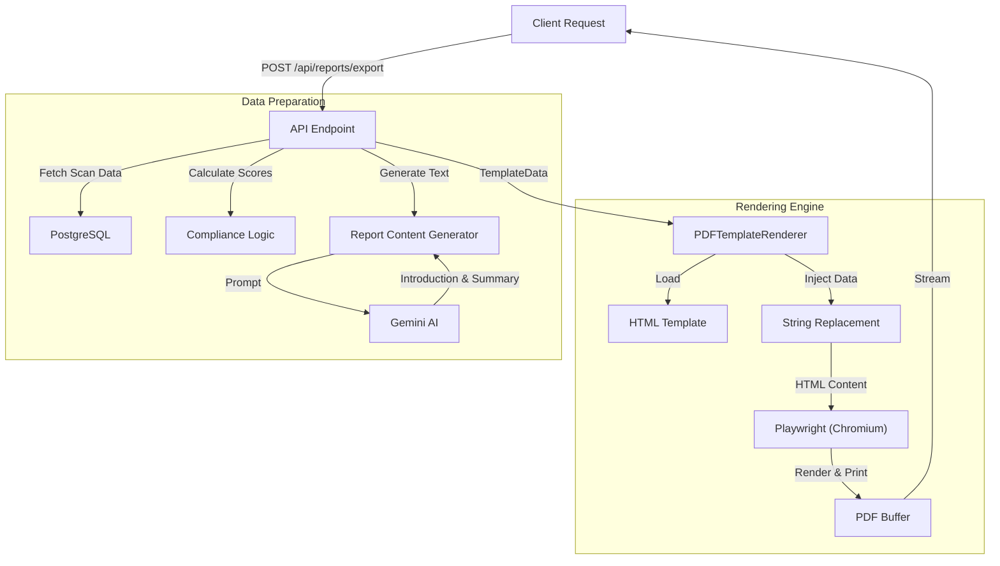

# RaawiX PDF Export System Architecture

## Overview

The RaawiX project uses a **Headless Browser Rendering** approach to generate high-quality, professional PDF reports. Instead of using traditional low-level PDF libraries (like `pdfkit` or `jsPDF`) to draw text and lines coordinates, it renders a standard **HTML/CSS template** using **Playwright** (Headless Chromium) and prints it to PDF.

This approach offers significant advantages:
- **Design Flexibility**: Use standard CSS/Flexbox/Grid for layout.
- **Typography**: Complete control over fonts, robust support for RTL (Arabic) text, and complex text shaping.
- **Maintainability**: Modifying the report design is as simple as editing an HTML file.

## Architecture Diagram



## Key Components

### 1. API Endpoint (`pdf-export.ts`)
**Location:** `apps/scanner/src/api/pdf-export.ts`
- **Role**: Orchestrator.
- **Responsibilities**:
    - Validates request (scanId, locale).
    - Fetches raw data from the database.
    - Calculates derived metrics (compliance scores).
    - Orquestrates content generation (AI vs Fallback).
    - Prepares the flat data object (`TemplateData`) for the renderer.
    - Handles HTTP response headers for file download.

### 2. Rendering Engine (`pdf-template-renderer.ts`)
**Location:** `apps/scanner/src/services/pdf-template-renderer.ts`
- **Role**: The Core Engine.
- **Responsibilities**:
    - Manages the Playwright browser instance.
    - Loads the HTML template file.
    - Performs variable substitution (e.g., replacing `{{reportTitle}}` with actual text).
    - Injects specific CSS/Fonts for Arabic support if needed.
    - Launches a headless page, sets content, and generates the PDF.
    - **Fallback**: Contains logic to fall back to `pdf-lib` if Playwright fails (though currently re-throws to API).

### 3. HTML Template (`report-template.html`)
**Location:** `apps/scanner/src/templates/report-template.html`
- **Role**: The View.
- **Responsibilities**:
    - Defines the visual structure using HTML5.
    - Uses internal CSS for styling (print-optimized).
    - Handles RTL layout automatically via CSS variables or classes (`dir="{{direction}}"`).
    - Uses **Cairo** font from Google Fonts for proper Arabic typography.

### 4. Content Generator (`report-content-generator.ts`)
**Location:** `apps/scanner/src/services/report-content-generator.ts`
- **Role**: The "Author".
- **Responsibilities**:
    - Constructs prompts for Google Gemini AI based on scan stats.
    - Asks AI to write the **Introduction**, **Executive Summary**, and **Key Findings**.
    - Parses the AI response.
    - Provides **hardcoded fallback text** if AI is disabled or fails.

### 5. Internationalization (`pdf-i18n.ts`)
**Location:** `apps/scanner/src/utils/pdf-i18n.ts`
- **Role**: Translator.
- **Responsibilities**:
    - Simple dictionary mapping keys to English and Arabic strings.
    - Used for static labels (e.g., "Table of Contents", "Page", "Status").

## Dependencies

To replicate this system, you need the following dependencies:

```json
{
  "dependencies": {
    "playwright": "^1.40.0",        // The rendering engine
    "pdf-lib": "^1.17.1",           // For metadata or fallbacks (optional)
    "@google/generative-ai": "...", // For AI content (optional)
    "zod": "..."                    // For validation
  }
}
```

> **Note**: You must ensure the Playwright browsers are installed in your environment (`npx playwright install chromium`).

## How to Reuse This Method

To implement this in another system, follow these steps:

### Step 1: Create the HTML Template
Create a standalone HTML file that looks exactly how you want the PDF to look.
- Use `{{variableName}}` placeholders.
- Use explicit CSS page breaks:
  ```css
  .page-break { page-break-after: always; }
  ```
- For Arabic, ensure you import a suitable font like Cairo or Tajawal and set `font-family`.

### Step 2: Implement the Renderer
Copy the logic from `pdf-template-renderer.ts`. The core function is simple:

```typescript
import { chromium } from 'playwright';

async function generatePdf(htmlContent: string) {
  const browser = await chromium.launch({ headless: true });
  const page = await browser.newPage();
  await page.setContent(htmlContent, { waitUntil: 'networkidle' });
  const pdfBuffer = await page.pdf({ format: 'A4', printBackground: true });
  await browser.close();
  return pdfBuffer;
}
```

### Step 3: Prepare the Data
Write a service that gathers all your data and formats it into a simple JSON object that matches your template placeholders.

### Step 4: String Replacement
Before passing HTML to Playwright, simply run a replace:

```typescript
let html = fs.readFileSync('template.html', 'utf8');
Object.keys(data).forEach(key => {
  html = html.replace(new RegExp(`{{${key}}}`, 'g'), data[key]);
});
```

### Step 5: (Optional) AI Integration
If you need dynamic text summaries, integrate an LLM (OpenAI/Gemini) to generate text blocks and inject them into the template just like any other variable.

## Advantages of This Method for RaawiX
1.  **Bilingual Support**: HTML/CSS handles RTL (Right-to-Left) text direction and font shaping natively, which is notoriously difficult in PDF generation libraries.
2.  **Visual Quality**: The reports look exactly like modern web pages, with gradients, shadow, and flex layouts.
3.  **Speed of Iteration**: Designers can work on the HTML template without needing to know backend code.

# Full Implementation Code

## 1. HTML Template (with CSS)

The following looks complex, but it's just standard HTML/CSS. Note the `@media print` query and the `page-break-after` property.

```html
<!DOCTYPE html>
<html lang="{{locale}}" dir="{{direction}}">
<head>
  <meta charset="UTF-8">
  <meta name="viewport" content="width=device-width, initial-scale=1.0">
  <title>Raawi X Accessibility Report</title>
  <style>
    @import url('https://fonts.googleapis.com/css2?family=Cairo:wght@400;600;700&display=swap');
    
    * {
      margin: 0;
      padding: 0;
      box-sizing: border-box;
    }
    
    body {
      font-family: 'Segoe UI', Tahoma, Geneva, Verdana, sans-serif;
      line-height: 1.6;
      color: #333;
      background: #fff;
    }
    
    /* Force Cairo font for Arabic */
    [dir="rtl"],
    [dir="rtl"] * {
      font-family: 'Cairo', 'Segoe UI', Tahoma, Geneva, Verdana, sans-serif !important;
    }
    
    [dir="rtl"] {
      direction: rtl;
      text-align: right;
    }
    
    [dir="ltr"] {
      direction: ltr;
      text-align: left;
    }
    
    .page {
      width: 210mm;
      min-height: 297mm;
      padding: 20mm;
      margin: 0 auto;
      background: white;
      page-break-after: always;
    }
    
    .cover-page {
      display: flex;
      flex-direction: column;
      justify-content: center;
      align-items: center;
      text-align: center;
      min-height: 100%;
    }
    
    .logo {
      max-width: 250px;
      height: auto;
      margin-bottom: 30px;
      margin-top: 40px;
    }
    
    .cover-title {
      font-size: 36px;
      font-weight: bold;
      color: #059669;
      margin-bottom: 40px;
      margin-top: 20px;
    }
    
    .cover-subtitle {
      font-size: 24px;
      color: #333;
      margin-bottom: 40px;
    }
    
    .entity-logo-container {
      margin: 30px 0;
      padding: 20px;
    }
    
    .entity-logo {
      max-width: 250px;
      max-height: 100px;
      height: auto;
      object-fit: contain;
    }
    
    .separator-line {
      width: 50%;
      height: 3px;
      background: linear-gradient(to right, transparent, #059669, transparent);
      margin: 30px auto;
    }
    
    .cover-info {
      font-size: 16px;
      color: #333;
      line-height: 2.2;
      margin-top: 30px;
      text-align: left;
      max-width: 500px;
    }
    
    .cover-info div {
      margin-bottom: 8px;
    }
    
    .cover-info strong {
      color: #000;
      font-weight: 600;
    }
    
    .powered-by-footer {
      position: absolute;
      bottom: 30px;
      left: 50%;
      transform: translateX(-50%);
    }
    
    .powered-by-logo {
      max-width: 200px;
      height: auto;
    }
    
    .header {
      border-bottom: 3px solid #059669;
      padding-bottom: 15px;
      margin-bottom: 30px;
    }
    
    .header h1 {
      font-size: 28px;
      color: #059669;
      margin-bottom: 10px;
    }
    
    .header .meta {
      font-size: 12px;
      color: #666;
    }
    
    .section {
      margin-bottom: 40px;
    }
    
    .section-title {
      font-size: 22px;
      color: #059669;
      margin-bottom: 20px;
      padding-bottom: 10px;
      border-bottom: 2px solid #e5e7eb;
    }
    
    .intro-content {
      font-size: 14px;
      line-height: 1.8;
      color: #444;
      text-align: justify;
      margin-bottom: 20px;
    }
    
    .score-grid {
      display: grid;
      grid-template-columns: repeat(3, 1fr);
      gap: 20px;
      margin-bottom: 30px;
    }
    
    .score-card {
      background: #f9fafb;
      border: 2px solid #e5e7eb;
      border-radius: 8px;
      padding: 20px;
      text-align: center;
    }
    
    .score-card .label {
      font-size: 14px;
      color: #666;
      margin-bottom: 10px;
    }
    
    .score-card .value {
      font-size: 32px;
      font-weight: bold;
      color: #059669;
      margin-bottom: 5px;
    }
    
    .score-card .detail {
      font-size: 12px;
      color: #888;
    }
    
    .stats-grid {
      display: grid;
      grid-template-columns: repeat(2, 1fr);
      gap: 15px;
      margin-bottom: 30px;
    }
    
    .stat-item {
      padding: 15px;
      background: #f9fafb;
      border-left: 4px solid #059669;
    }
    
    .stat-item .label {
      font-size: 12px;
      color: #666;
      margin-bottom: 5px;
    }
    
    .stat-item .value {
      font-size: 20px;
      font-weight: bold;
      color: #333;
    }
    
    .findings-table {
      width: 100%;
      border-collapse: collapse;
      margin-top: 20px;
    }
    
    .findings-table th {
      background: #059669;
      color: white;
      padding: 12px;
      text-align: left;
      font-size: 12px;
      font-weight: bold;
    }
    
    [dir="rtl"] .findings-table th {
      text-align: right;
    }
    
    .findings-table td {
      padding: 10px 12px;
      border-bottom: 1px solid #e5e7eb;
      font-size: 11px;
    }
    
    .findings-table tr:hover {
      background: #f9fafb;
    }
    
    .badge {
      display: inline-block;
      padding: 4px 8px;
      border-radius: 4px;
      font-size: 10px;
      font-weight: bold;
    }
    
    .badge-fail {
      background: #fee2e2;
      color: #991b1b;
    }
    
    .badge-review {
      background: #fef3c7;
      color: #92400e;
    }
    
    .badge-pass {
      background: #d1fae5;
      color: #065f46;
    }
    
    .level-badge {
      background: #e0e7ff;
      color: #3730a3;
      padding: 2px 6px;
      border-radius: 3px;
      font-size: 10px;
    }
    
    .footer {
      margin-top: 40px;
      padding-top: 20px;
      border-top: 1px solid #e5e7eb;
      font-size: 10px;
      color: #888;
      text-align: center;
    }
    
    .disclaimer {
      background: #fef3c7;
      border-left: 4px solid #f59e0b;
      padding: 15px;
      margin-top: 30px;
      font-size: 12px;
      color: #92400e;
    }
    
    @media print {
      .page {
        margin: 0;
        padding: 15mm;
      }
    }
  </style>
</head>
<body>
  <!-- Cover Page -->
  <div class="page cover-page">
    
    <h1 class="cover-title">{{reportTitle}}</h1>
    
    <!-- Entity Logo -->
    <div class="entity-logo-container" style="{{entityLogoDisplay}}">
      
    </div>
    
    <!-- Separator Line -->
    <div class="separator-line"></div>
    
    <!-- Entity Information -->
    <div class="cover-info">
      <div><strong>{{entityLabel}}:</strong> {{entityName}}</div>
      <div><strong>{{propertyLabel}}:</strong> {{propertyName}}</div>
      <div><strong>{{scanDateLabel}}:</strong> {{scanDate}}</div>
      <div><strong>{{entityCodeLabel}}:</strong> {{entityCode}}</div>
    </div>
    
    <!-- Powered By Footer -->
    <div class="powered-by-footer">
      
    </div>
  </div>
  
  <!-- Introduction Page -->
  <div class="page">
    <div class="header">
      <h1>{{introductionTitle}}</h1>
      <div class="meta">{{reportGeneratedOn}} {{generationDate}}</div>
    </div>
    
    <div class="section">
      <div class="intro-content">
        {{introductionContent}}
      </div>
    </div>
    
    <!-- Additional page content omitted for brevity -->
    
  </div>
   
  <!-- Footer -->
  <div class="footer">
    <p>{{footerText}}</p>
    <p>{{reportGeneratedBy}} Raawi X Accessibility Platform</p>
  </div>
</body>
</html>
```

## 2. Renderer Service (`pdf-template-renderer.ts`)

Note how `renderWithPlaywright` handles the string replacement and browser automation.

```typescript
/**
 * PDF Template Renderer
 * 
 * Renders HTML template to PDF using Playwright
 * Falls back to pdf-lib if Playwright fails
 */

import { readFile } from 'node:fs/promises';
import { join, dirname } from 'node:path';
import { fileURLToPath } from 'url';
import { Browser, chromium } from 'playwright';
import { PDFDocument } from 'pdf-lib';
import { config } from '../config.js';
import { StructuredLogger } from '../utils/logger.js';

const __filename = fileURLToPath(import.meta.url);
const __dirname = dirname(__filename);

export interface TemplateData {
  // Logos
  logoDataUrl: string;
  entityLogoDataUrl?: string;
  entityLogoDisplay?: string;
  poweredByLogoDataUrl: string;
  
  // Cover page
  reportTitle: string;
  subtitle: string;
  entityName: string;
  propertyName: string;
  scanDate: string;
  entityCode: string;
  
  // Labels (i18n)
  entityLabel: string;
  propertyLabel: string;
  scanDateLabel: string;
  entityCodeLabel: string;
  
  // Introduction
  introductionTitle: string;
  introductionContent: string;
  reportGeneratedOn: string;
  generationDate: string;
  
  // Executive Summary
  executiveSummaryTitle: string;
  wcagALabel: string;
  wcagAALabel: string;
  needsReviewLabel: string;
  scoreA: string;
  scoreAA: string;
  needsReviewRate: string;
  scoreADetail: string;
  scoreAADetail: string;
  needsReviewDetail: string;
  
  // Statistics
  scanStatisticsTitle: string;
  totalPagesLabel: string;
  totalFindingsLabel: string;
  failedRulesLabel: string;
  needsReviewRulesLabel: string;
  totalPages: string;
  totalFindings: string;
  failedRules: string;
  needsReviewRules: string;
  
  // Findings
  keyFindingsTitle: string;
  keyFindingsContent: string;
  topFindingsTitle: string;
  wcagIdHeader: string;
  levelHeader: string;
  statusHeader: string;
  descriptionHeader: string;
  pageHeader: string;
  findingsRows: string;
  
  // Footer
  footerText: string;
  reportGeneratedBy: string;
  disclaimerText: string;
  
  // Layout
  locale: 'en' | 'ar';
  direction: 'ltr' | 'rtl';
}

export class PDFTemplateRenderer {
  private logger: StructuredLogger;
  private browser: Browser | null = null;

  constructor(scanId?: string) {
    this.logger = new StructuredLogger(scanId);
  }

  /**
   * Render HTML template to PDF using Playwright
   */
  async renderToPDF(data: TemplateData): Promise<Buffer> {
    try {
      // Try Playwright first (better quality)
      return await this.renderWithPlaywright(data);
    } catch (error) {
      this.logger.warn('Playwright PDF rendering failed, using fallback', {
        error: error instanceof Error ? error.message : 'Unknown error',
      });
      // Fallback to pdf-lib
      return await this.renderWithPdfLib(data);
    }
  }

  /**
   * Render using Playwright (high quality, supports CSS)
   */
  private async renderWithPlaywright(data: TemplateData): Promise<Buffer> {
    if (!this.browser) {
      this.browser = await chromium.launch({
        headless: true,
        args: ['--no-sandbox', '--disable-setuid-sandbox'],
      });
    }

    const page = await this.browser.newPage();
    
    try {
      // Load template
      const templatePath = join(__dirname, '../templates/report-template.html');
      let template = await readFile(templatePath, 'utf-8');
      
      // Replace all template variables
      Object.entries(data).forEach(([key, value]) => {
        const regex = new RegExp(`{{${key}}}`, 'g');
        template = template.replace(regex, String(value || ''));
      });
      
      // Ensure Cairo font is loaded and used for Arabic
      // The CSS already has the @import and RTL selector, but we ensure it's applied
      if (data.locale === 'ar' && !template.includes('fonts.googleapis.com/css2?family=Cairo')) {
        // Add Cairo font import if not present
        const cairoImport = '<link href="https://fonts.googleapis.com/css2?family=Cairo:wght@400;600;700&display=swap" rel="stylesheet">';
        template = template.replace('</head>', `  ${cairoImport}\n</head>`);
      }
      
      // Set content
      await page.setContent(template, { waitUntil: 'networkidle' });
      
      // Generate PDF
      const pdfBuffer = await page.pdf({
        format: 'A4',
        printBackground: true,
        margin: {
          top: '0mm',
          right: '0mm',
          bottom: '0mm',
          left: '0mm',
        },
      });
      
      return Buffer.from(pdfBuffer);
    } finally {
      await page.close();
    }
  }

  /**
   * Fallback: Render using pdf-lib (basic, no CSS)
   * This is a minimal fallback - the main endpoint handles full fallback
   */
  private async renderWithPdfLib(data: TemplateData): Promise<Buffer> {
    // Re-throw to let main endpoint handle fallback
    throw new Error('Playwright rendering failed, fallback handled by main endpoint');
  }

  /**
   * Cleanup browser instance
   */
  async close(): Promise<void> {
    if (this.browser) {
      await this.browser.close();
      this.browser = null;
    }
  }
}
```
