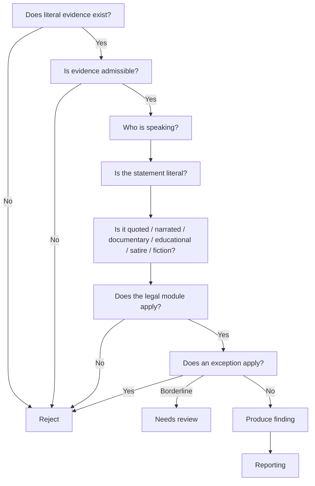

# Analysis Engine V3 Decision Graph

This document defines the global decision architecture for Analysis Engine V3.

It is implementation-independent.
It does not describe prompts, runtime plumbing, or provider-specific behavior.

The decision graph sits above the reasoning contract and defines how reasoning flows from one class of decision to the next.

## 1. Purpose

The decision graph exists to define:

- the global order of reasoning
- which node types may connect
- which nodes may not connect
- how evidence, context, legal logic, exceptions, and reporting interact
- where reasoning may exit early

## 2. Core Idea

The decision graph is not a prompt.
It is not a parser.
It is not a runtime pipeline.

It is the structural map that tells V3 how to move from raw text to a legal outcome.

## 3. Global Flow

The default flow is:

1. Evidence Node
2. Narrative Node
3. Context Node
4. Legal Node
5. Exception Node
6. Reporting Node

This order is normative.
Later stages may terminate the flow, but they may not reorder the earlier dependency chain.

## 4. Node Catalog

The full node catalog is defined in [graphNodes.md](graphNodes.md).

## 5. Edge Catalog

The edge catalog is defined in [graphEdges.md](graphEdges.md).

## 6. Decision Types

The node typing model is defined in [decisionTypes.md](decisionTypes.md).

## 7. Exit Conditions

Global exit conditions are defined in [exitConditions.md](exitConditions.md).

## 8. Priority Systems

Evidence priority is defined in [evidencePriority.md](evidencePriority.md).

Context priority is defined in [contextPriority.md](contextPriority.md).

## 9. Global Flow Diagram

```text
Does literal evidence exist?
  ↓
Is evidence admissible?
  ↓
Who is speaking?
  ↓
Is speaker identifiable?
  ↓
Is the statement literal?
  ↓
Is it quoted?
  ↓
Is it narrated?
  ↓
Is it documentary?
  ↓
Is it educational?
  ↓
Is it satire?
  ↓
Is it fiction?
  ↓
Is it condemnation?
  ↓
Is it endorsement?
  ↓
Is there sufficient evidence?
  ↓
Does the legal module apply?
  ↓
Does an exception apply?
  ↓
Produce finding?
  ↓
Needs review?
  ↓
Reject?
```

## 10. Global Exit Semantics

The graph may exit at three broad outcomes:

- produce finding
- needs review
- reject

Each of these is a terminal interpretation of the current reasoning path.

## 11. Example Decision Graph



## 12. Design Rules

- Evidence must be considered before legal judgment.
- Narrative must be established before exception handling.
- Context may refine interpretation, but may not create evidence.
- Reporting must not change the legal outcome.
- A node may only consume the outputs of upstream nodes.

## 13. Implementation Independence

The graph must remain valid regardless of:

- prompt wording
- AI provider
- specific subject module
- runtime pipeline shape

The decision graph is the stable architecture beneath all future V3 prompts.

