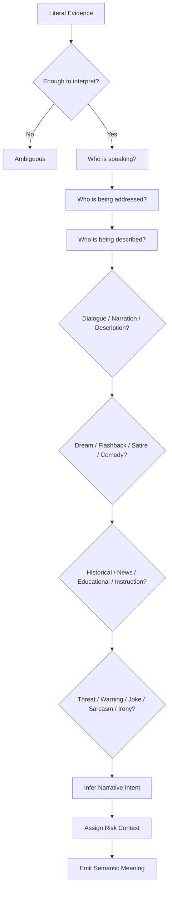
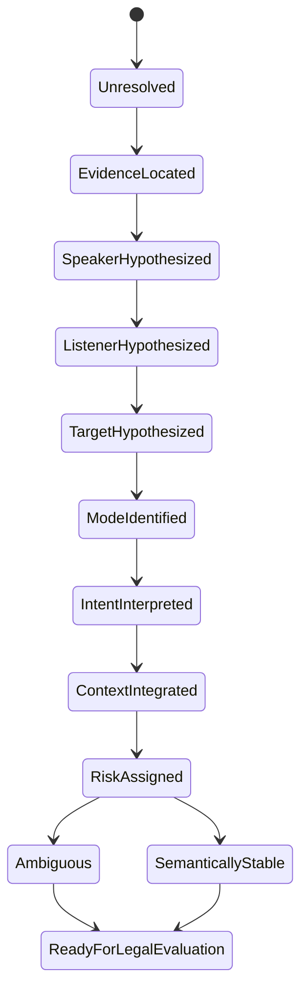

# Semantic Decision Graph

This file defines the semantic reasoning path.

The semantic graph sits between evidence identification and legal evaluation.

## Flow

```text
Literal Evidence
  ↓
Is the sentence complete enough to interpret?
  ↓
Who is speaking?
  ↓
Who is being addressed?
  ↓
Who is being described?
  ↓
Is the sentence dialogue?
  ↓
Is it narration?
  ↓
Is it scene description?
  ↓
Is it dream?
  ↓
Is it flashback?
  ↓
Is it satire?
  ↓
Is it comedy?
  ↓
Is it training?
  ↓
Is it historical quotation?
  ↓
Is it news?
  ↓
Is it educational?
  ↓
Is it instruction?
  ↓
Is it threat?
  ↓
Is it warning?
  ↓
Is it joke?
  ↓
Is it sarcasm?
  ↓
Is it irony?
  ↓
What is the narrative intent?
  ↓
What is the risk context?
  ↓
Semantic Meaning
```

## Node ordering

The semantic graph is ordered from form to meaning:

1. Evidence presence
2. Speaker and listener identification
3. Narrative mode
4. Context reversal checks
5. Narrative intent
6. Risk context
7. Semantic meaning output

## Mermaid diagram



## State diagram



