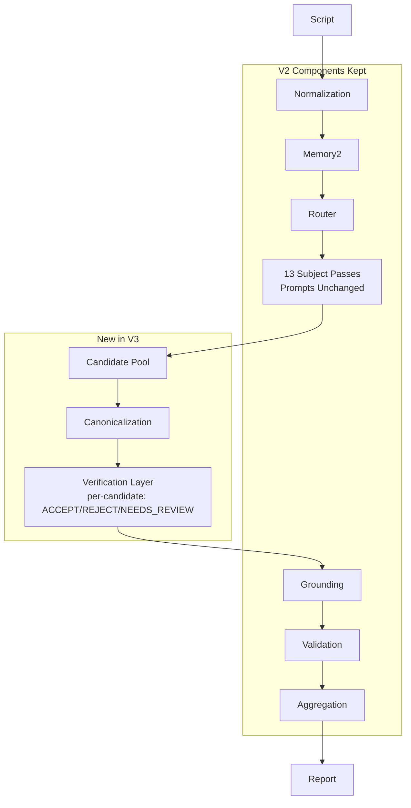

# Pipeline V3 Architecture Design

## Executive Summary

Pipeline V3 is an evolution of Pipeline V2, not a rewrite.

It preserves:
- Memory2
- Router
- 13 subject prompts (unchanged text)
- Multipass execution
- Grounding
- Validation
- Aggregation

It adds one new stage between Canonicalization and Grounding:
- Candidate Verification Layer

Core architectural change:
- Subject passes become candidate generators.
- Verifier becomes final acceptance gate.

This separates discovery from decision and directly addresses instability concentrated in broad semantic passes:
- v4_04_historical_documentary_reliability
- v4_05_society_identity_generalization
- v4_06_children_crime_security
- v4_12_other

No majority voting. No repeated inference loops. No prompt simplification.

## 1. Architecture Diagram

## 2. Execution Flow

1. Run existing V2 front half unchanged:
- normalization, Memory2, router, multipass subject detection.

2. Convert pass findings into a unified candidate pool:
- one candidate row per finding,
- immutable payload (article, atom, rationale, snippet, offsets, pass name, chunk id).

3. Canonicalize candidates before verifier call:
- stable keying,
- text normalization,
- deterministic field completion,
- remove exact duplicate candidates only.

4. Verify each candidate exactly once:
- input includes candidate + local context + Memory2 context,
- output must be one of: ACCEPT, REJECT, NEEDS_REVIEW.

5. Keep only ACCEPT and NEEDS_REVIEW candidates.

6. Continue existing V2 grounding, validation, aggregation unchanged.

## 3. New Verification Layer

### 3.1 Responsibilities

Verifier does:
- evaluate one existing candidate finding.
- output only classification.

Verifier does not:
- discover new findings,
- merge findings,
- deduplicate globally,
- rewrite pass prompts,
- run retries for consensus.

### 3.2 Verifier Input Contract

Per candidate input payload:
- article_id
- atom_id or canonical_atom
- title_ar
- rationale_ar
- evidence_snippet
- location.start_offset
- location.end_offset
- detection_pass
- local_context_window
- story_memory_context (Memory2)

### 3.3 Verifier Output Contract

Strict schema:
- decision: ACCEPT | REJECT | NEEDS_REVIEW

Optional metadata may be persisted server-side (not model output requirements), for example:
- verifier_model
- verifier_latency_ms
- confidence_bucket (derived)

### 3.4 Prompt Strategy

Keep existing subject prompts unchanged.

Add a dedicated verifier system prompt with hard constraints:
- no new findings,
- no alternative article mapping,
- no free-form commentary,
- mandatory single label output.

### 3.5 Determinism Strategy

Determinism gains come from role narrowing:
- broad subject prompts remain high-recall candidate generators,
- verifier is binary/triage classifier with low output entropy.

## 4. Required Database Changes

### 4.1 New Tables

1. analysis_candidate_findings
- id uuid pk
- job_id uuid not null
- chunk_id uuid not null
- candidate_key text not null
- detection_pass text not null
- article_id int null
- atom_id text null
- canonical_atom text null
- title_ar text null
- rationale_ar text null
- evidence_snippet text not null
- start_offset int not null
- end_offset int not null
- candidate_payload jsonb not null
- created_at timestamptz default now()

Unique index:
- (job_id, chunk_id, candidate_key)

2. analysis_candidate_verifications
- id uuid pk
- candidate_id uuid references analysis_candidate_findings(id)
- job_id uuid not null
- chunk_id uuid not null
- verifier_decision text not null check in ('ACCEPT','REJECT','NEEDS_REVIEW')
- verifier_model text not null
- verifier_prompt_hash text null
- verifier_latency_ms int null
- created_at timestamptz default now()

Indexes:
- (job_id, chunk_id)
- (job_id, verifier_decision)
- (candidate_id)

### 4.2 Existing Tables (Optional Extensions)

analysis_judge_diagnostics:
- add diagnostic_kind = 'verification_decision' (optional if reuse is preferred).

Recommendation:
- store candidate/verification in dedicated tables for forensic clarity and lower query complexity.

## 5. Required Code Changes

No V2 logic removal. Add V3 branch and shared adapters.

1. Pipeline orchestration
- Add V3 execution branch in runner.
- Insert new stages: candidate pool build, canonicalization, verification.

2. Candidate model/schema
- Add CandidateFinding type and parser.
- Add candidate key function for deterministic identity.

3. Verification service
- New verifier call function in OpenAI adapter.
- New parse function enforcing strict enum output.

4. Persistence
- Persist candidate findings.
- Persist verification decisions.
- Build accepted/needs_review stream for downstream existing grounding+validation.

5. Config flags
- ANALYSIS_PIPELINE_VERSION = v2|v3
- VERIFIER_MODEL
- VERIFIER_ENABLED
- VERIFIER_FAIL_MODE = fail_open|fail_closed (default fail_open during rollout)

## 6. Which Existing Files Change

Primary existing files to modify:
- [apps/worker/src/pipelineRunner.ts](apps/worker/src/pipelineRunner.ts)
- [apps/worker/src/pipeline.ts](apps/worker/src/pipeline.ts)
- [apps/worker/src/pipelineV2.ts](apps/worker/src/pipelineV2.ts)
- [apps/worker/src/multiPassJudge.ts](apps/worker/src/multiPassJudge.ts)
- [apps/worker/src/openai.ts](apps/worker/src/openai.ts)
- [apps/worker/src/schemas.ts](apps/worker/src/schemas.ts)
- [apps/worker/src/config.ts](apps/worker/src/config.ts)
- [apps/worker/src/db.ts](apps/worker/src/db.ts)
- [apps/worker/src/judgeDiagnostics.ts](apps/worker/src/judgeDiagnostics.ts)

Existing downstream stages explicitly preserved:
- [apps/worker/src/evidenceGrounding.ts](apps/worker/src/evidenceGrounding.ts)
- [apps/worker/src/aggregation.ts](apps/worker/src/aggregation.ts)

## 7. Migration Strategy From V2

Phase 0: Schema-first (no behavior change)
- deploy new candidate and verification tables.

Phase 1: Dark-write mode
- run V2 behavior,
- additionally write candidate pool + verification decisions,
- do not gate final findings yet.

Phase 2: Shadow-compare mode
- compute V2 final findings and V3-gated findings in parallel,
- compare precision/recall/stability metrics offline.

Phase 3: Soft-gate mode
- gate only unstable passes by verifier:
  - v4_04, v4_05, v4_06, v4_12
- keep other passes direct.

Phase 4: Full V3 gate
- all passes route through verifier.

Phase 5: V2 fallback retained
- immediate toggle rollback via pipeline version flag.

## 8. Performance Impact

Expected latency impact:
- Additional per-candidate verification call.
- Total latency increase depends on candidate count density per chunk.

Estimated range:
- +18% to +55% end-to-end wall time.

Mitigations:
- parallel verifier calls with bounded concurrency,
- lightweight verifier prompt,
- reuse existing chunk-local context extraction,
- optional skip verification for trivially deterministic categories in later tuning.

## 9. Token Impact

Token delta drivers:
- one extra prompt+response per candidate.

Estimated aggregate token increase:
- +22% to +70% versus V2,
- concentrated in chunks producing many candidates from broad semantic passes.

Token controls:
- compact verifier input schema,
- bounded local context window,
- no chain-of-thought request,
- single-token class output target (enum label).

## 10. Cost Impact

Expected cost increase during full gating:
- +20% to +65% depending candidate volume and verifier model.

Rollout cost control plan:
- start with unstable-pass-only verification,
- use smaller verifier model where quality allows,
- apply concurrency caps instead of retries,
- keep one-shot verification (no majority voting).

## 11. Risk Analysis

1. Recall regression risk
- Over-rejection by verifier could drop true positives.
- Mitigation: NEEDS_REVIEW class and soft-gate rollout.

2. Latency/cost spikes
- High-candidate chunks may become expensive.
- Mitigation: bounded verifier concurrency and model tiering.

3. Contract drift risk
- Verifier output format drift.
- Mitigation: strict schema parser, fallback handling.

4. Operational complexity
- More tables and trace paths.
- Mitigation: clear job-level lineage keys (job_id/chunk_id/candidate_id).

## 12. Backward Compatibility

Guaranteed compatibility approach:
- V2 remains intact and selectable by feature flag.
- Existing prompt packs are unchanged.
- Existing report schema can remain unchanged.
- Existing aggregation contract preserved by feeding verified findings into same downstream pipeline.

## 13. How Existing Prompts Are Preserved

Prompt preservation rules:
- keep subject prompt files exactly unchanged,
- keep existing subject prompt assembly unchanged,
- do not alter pass routing taxonomy,
- only reinterpret pass output as candidates before final acceptance.

This keeps all prompt tuning investment while changing responsibility boundaries.

## 14. Expected Stability Improvements

Primary gain:
- isolate high-entropy discovery from final acceptance.

Expected outcomes after full rollout:
- lower run-to-run count variance in unstable passes,
- more consistent final totals for repeated identical scripts,
- clearer root-cause traces (candidate generated vs verifier rejected).

Indicative target:
- 40% to 70% reduction in run-to-run variance for the four unstable passes.

## 15. Expected Recall Improvements

Net recall expectation:
- neutral to positive if verifier is tuned for conservative acceptance with NEEDS_REVIEW escape hatch.

Why recall can improve:
- discovery prompts remain broad/high-recall,
- false negatives from brittle "find+judge in one pass" are reduced by explicit secondary decision.

## 16. Edge Cases

1. Conflicting Memory2 vs local context
- verifier should prioritize local textual evidence for acceptance.

2. Offsets inconsistent with snippet
- verifier may mark NEEDS_REVIEW or REJECT based on mismatch policy.

3. Multiple candidates with near-identical evidence
- canonicalization dedupe before verification avoids redundant calls.

4. Catch-all v4_12 ambiguity
- candidate quality likely noisier; verifier expected to absorb ambiguity.

5. Empty-candidate chunks
- skip verifier stage entirely.

## 17. Rollback Strategy

Immediate rollback path:
- switch ANALYSIS_PIPELINE_VERSION back to v2.

Graceful rollback:
- keep writing candidate/verification tables disabled or in dark mode only.
- do not remove schema during rollback.

Operational safety:
- no destructive migration required for rollback.

## 18. Diagnostics: What Becomes Obsolete

Potentially less critical over time:
- pass_output_snapshot for every run, once candidate + verification lineage is fully trusted.

Still valuable:
- diagnostics for pass drift investigations,
- verification decision distribution by pass,
- candidate-to-final drop funnel metrics.

Recommendation:
- retain existing diagnostics during migration phases,
- deprecate selectively only after 2 to 4 weeks of stable V3 production metrics.

## v4_12_other Recommendation

Recommendation: decompose v4_12_other into semantic subpasses, but only with strict invariants.

Suggested decomposition:
- v4_12a_public_order_misc
- v4_12b_documentary_misc
- v4_12c_social_harm_misc
- v4_12d_behavioral_norms_misc

Guardrails:
- keep original prompt text blocks as reusable sections,
- route by deterministic lexical/topic anchors,
- preserve fallback to monolithic v4_12 when no subpass anchor is matched.

Why this helps determinism:
- narrows semantic search space per pass,
- reduces candidate entropy before verification,
- improves calibration without reducing recall if fallback is retained.

## Final Recommendation

Adopt Pipeline V3 as a staged architectural evolution:
- keep V2 components and prompts,
- add candidate + verification boundary,
- gate unstable passes first,
- expand after measured stability and recall gains.
